# Mission Orchestrator — Project Ontology

> **Purpose:** Single-operator decision support for a fleet of unmanned naval vehicles (UAV / USV / UUV). When a vehicle fails or degrades, the system recomputes mission health, raises alerts, ranks reassignment plans, and lets the operator commit — never auto-commits.

This document maps **what exists**, **how pieces relate**, and **where logic lives**. For build history see [HANDOVER.md](HANDOVER.md); for formulas see [BUILD.md](BUILD.md).

---

## 1. System at a glance

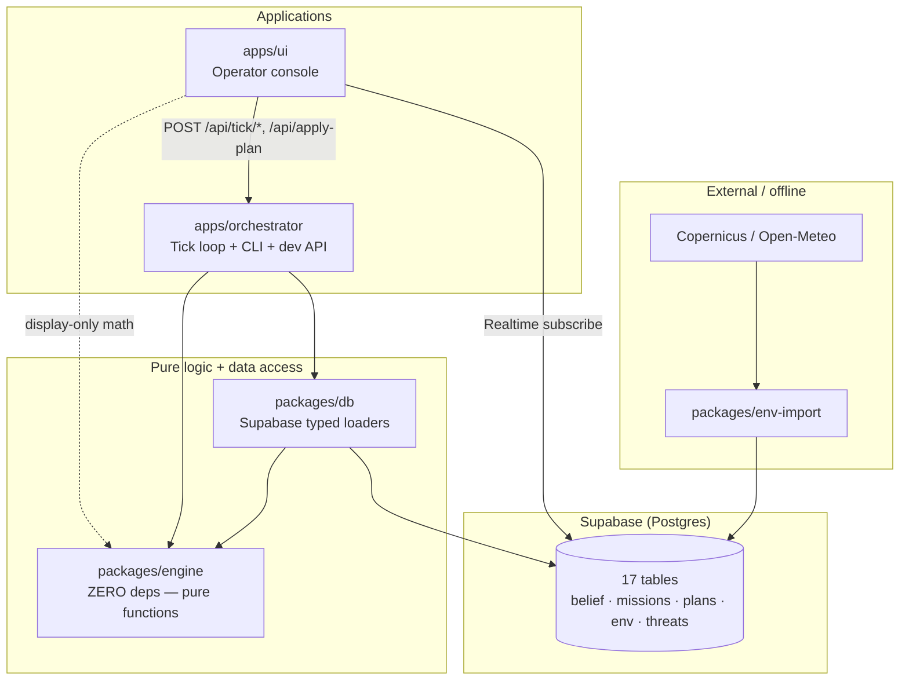

| Layer | Role | Reads `world_truth`? |
|-------|------|----------------------|
| **Simulator** (engine) | Writes ground truth + noisy reports (demo only) | Writes only |
| **Ingest** (engine) | Reports → `Belief` via `reconcile()` | Never |
| **State engine** (engine) | Pure `(belief, assignments, missions, now) → MissionState` | Never |
| **Planner** (engine) | Sandboxes moves, re-runs state engine, ranks `Obj` | Never |
| **Orchestrator** | Owns clock, persists rows, wires I/O | Never in engine path |
| **UI** | Read-mostly; operator commits plans | Never |

---

## 2. Monorepo package ontology

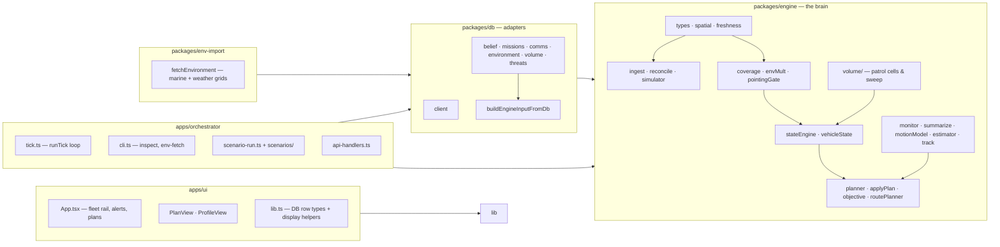

**Dependency rule (CI-enforced):** `packages/engine` has **no** database imports and **no** references to `world_truth`. All I/O stays in `packages/db` and `apps/orchestrator`.

---

## 3. Domain entity ontology

Concepts are grouped by **concern**. Arrows mean “feeds” or “owns”.

```mermaid
erDiagram
  ASSET ||--o{ ASSET_SENSOR : "capability vector"
  ASSET ||--o{ BELIEF_FACT : "known state"
  ASSET ||--o{ ASSIGNMENT : "currently assigned"
  ASSET ||--o{ REPORT : "telemetry packets"

  MISSION ||--|{ TASK : "contains"
  TASK ||--o{ TASK_DEMAND : "graded sensor need"
  TASK ||--o{ TASK_CONSTRAINT : "hard gate"
  TASK ||--o{ TASK_VOLUME_VISIT : "patrol memory (AREA)"
  TASK ||--o{ ASSIGNMENT : "work target"

  MISSION ||--o{ MISSION_STATE : "derived each tick"
  MISSION ||--o{ ALERT_LOG : "when salient"

  CANDIDATE_PLAN ||--|| PLAN_EVAL : "ranked score"
  DECISION_LOG }o--|| CANDIDATE_PLAN : "operator choice"

  COMMS_NODE ||--o{ COMMS_LINK : "graph"
  ENVIRONMENT_SAMPLE }o--|| TASK : "sampled near targets"
  THREAT }o--|| ROUTE_PLANNER : "exposure/risk"
  NO_GO_ZONE }o--|| ROUTE_PLANNER : "hard prune"

  ASSET {
    string id PK
    enum kind "UAV|USV|UUV"
    enum domain "air|surface|subsurface"
    float depth_rating_m
    float top_speed_kn
  }

  ASSET_SENSOR {
    string asset_id FK
    string sensor PK
    float base_quality
    float max_range_km
    float k_motion
    float beam_half_angle_deg "nullable — C2"
  }

  BELIEF_FACT {
    string asset_id PK
    string field PK
    jsonb value
    bigint ts
    float confidence
    float half_life_s
  }

  MISSION {
    string id PK
    float priority "W_m"
    string name
  }

  TASK {
    string id PK
    string mission_id FK
    float w_t
    enum kind "POINT|AREA"
    float target_x target_y
    jsonb footprint "AREA only"
  }

  MISSION_STATE {
    string mission_id FK
    bigint tick
    float cov_baseline "sticky"
    float cov_now
    enum tier "FULL|DEGRADED|AT_RISK|LOST"
    float confidence
    float impact urgency salience
  }

  ASSIGNMENT {
    string asset_id FK
    string task_id FK
    string operating_point "STATION|SLOW|FAST"
  }
```

### Entity roles (plain language)

| Entity | Mutable by | Meaning |
|--------|------------|---------|
| **Asset / AssetSensor** | Seed / admin | Static fleet spec; capability is a **vector** over sensors (P4) |
| **WorldTruth** | Simulator only | Ground truth for demos — engine never reads it |
| **Report** | Simulator | Raw packets (may drop, delay, drift) |
| **BeliefFact** | Ingest | System knowledge; keyed `(asset_id, field)` |
| **Mission / Task** | Seed / operator | Demand side: tasks bundle demands + hard constraints |
| **Assignment** | Plans (`applyPlan`) | Supply side: who does what at which operating point |
| **MissionState** | State engine each tick | **The one derived object** (P3) — alerts & planner read this |
| **AlertLog** | Monitor + summarize | Append-only; `summary_text` is narration only (P8) |
| **CandidatePlan / PlanEval** | Planner | Ranked options including do-nothing (P9) |
| **DecisionLog** | Operator commit | Accountability trail |
| **Config** | Seed | Tunables: tiers, λ weights, half-life H, salience σ |

---

## 4. Belief pipeline (perception layer)

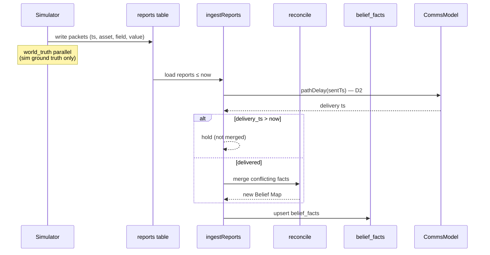

**Key invariants:**
- Belief is a `Map<asset_id:field, Fact>` with time-decayed confidence: `freshness(Δt) = exp(−Δt / H)`.
- `reconcile()` is the seam for spoofing / adversarial data (D4 — body stub installed).
- Comms graph (`comms_nodes`, `comms_links`) affects **when** facts arrive, not what the engine computes.

---

## 5. Tick loop — order of operations

The orchestrator owns **`now`** (one tick = one second in demo). The engine never calls `Date.now()`.

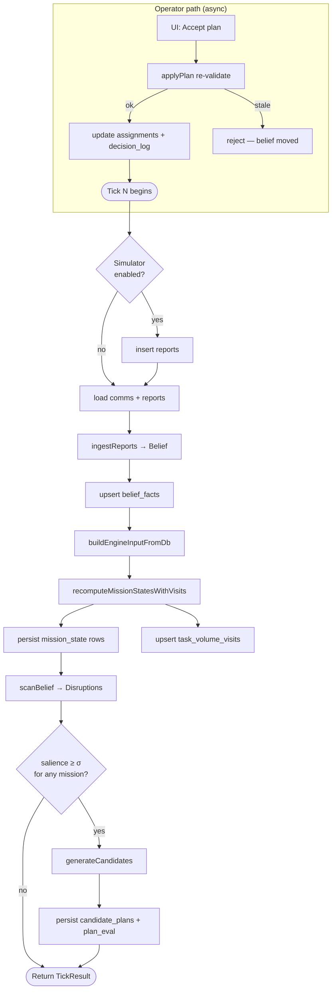

**`buildEngineInputFromDb` loads in parallel:**
`belief`, `assets`, `sensors`, `missions`, `assignments`, `config`, `covBaselines`, `environmentContext`, `commsModel`, `volumeVisits`, `routePlanner`.

---

## 6. Coverage engine — logic hierarchy

The state engine is a **pure function** of `(belief, assignments, missionDefs, now)` (P2). The planner simulates futures by calling the **same** function on cloned assignments.

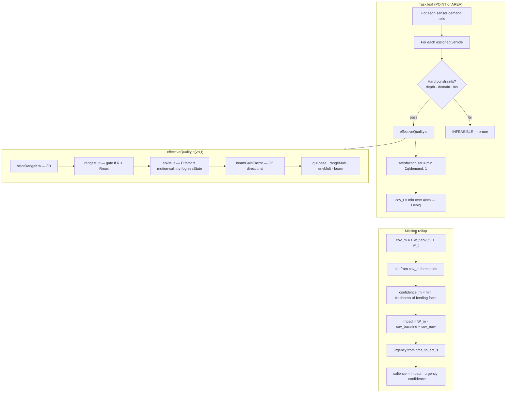

### Formula reference

| Symbol | Formula | Principle |
|--------|---------|-----------|
| `freshness` | `exp(−Δt / H)` | Facts decay; H from config |
| `rangeMult` | `(1 − R/Rmax)^p` | Gate: `R > Rmax` → INFEASIBLE (P5) |
| `envMult` | `Π_k m_k(context, sensor)` | Extensible factor list (P1) |
| `sat(t,s)` | `min(Σ_v q / demand, 1)` | Vehicles team on same axis |
| `cov_t` | `min_s sat(t,s)` | Task = weakest sensor (P7) |
| `cov_m` | weighted avg of `cov_t` | Mission tolerates weak minor tasks (P7) |
| `confidence` | min freshness | **Never** multiplied into coverage (P6) |
| `salience` | `impact · urgency · confidence` | Alert if ≥ σ |

### Task kinds

| Kind | Leaf module | Extra state |
|------|-------------|-------------|
| **POINT** | `computePointTaskLeaf` | Fixed target `(x, y, depth)` |
| **AREA** | `coverageVolume` (C1) | Discretized footprint cells + `task_volume_visits` memory |

---

## 7. Planning ontology

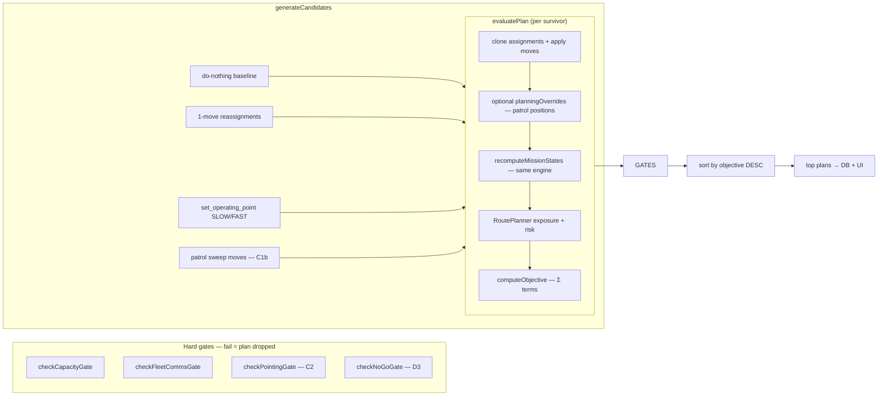

### Plan move types

```typescript
type PlanMove =
  | { kind: "reassign"; asset_id; task_id; operating_point }
  | { kind: "set_operating_point"; asset_id; operating_point };
```

### Objective (ranking only — P10)

```
Obj(plan) = Σ_m W_m·cov_m(plan)
          − λ_move·moves
          − λ_exp·exposure
          − λ_risk·risk
```

Terms are registered in `DEFAULT_OBJECTIVE_TERMS` — same extensibility pattern as `envMult` factors.

### Commit path

`applyPlan` **re-validates** against **current** belief (not the snapshot from evaluation). Stale plans are rejected; committed plans write `assignments` and append `decision_log`.

---

## 8. Seam architecture (contracts vs bodies)

The project follows **P1 — contracts freeze, bodies expand**. Callers depend on a **frozen contract** (function signature, interface, or registry list). Complexity enters by **swapping or extending the body** behind that contract — never by reshaping what upstream code calls.

Full build history and phase IDs: [EXPANSION_REGISTER.md](EXPANSION_REGISTER.md).

### Contract vs body (the pattern)

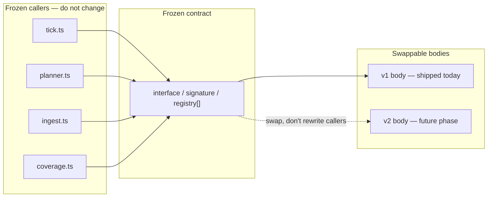

**Rules:**
- Add new behavior by **registering** into a list (`EnvFactor[]`, `ObjectiveTerm[]`) or **implementing** an interface (`Planner`, `RoutePlanner`, `Summarizer`).
- Hard cutoffs stay **gates** (return `INFEASIBLE` / `false`) — never low scores (P5).
- `EngineInput` is the injection point: bodies receive context via fields (`commsModel`, `environmentContext`, `routePlanner`), never via DB reads inside the engine (W8).

### Seam map (by concern)

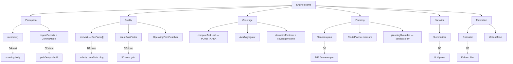

### Complete seam registry

| Concern | Contract (frozen) | Module | Current body | Next body | Status |
|---------|-----------------|--------|--------------|-----------|--------|
| **Perception** | `reconcile(existing, incoming) → Fact` | `reconcile.ts` | Newer `ts` wins; confidence passthrough | Lower confidence on conflicting sources | **stub** → D4 |
| **Perception** | `ingestReports(reports, belief, opts?) → Belief` | `ingest.ts` | Merge via `reconcile`; optional comms hold | — | **live** (D2) |
| **Perception** | `CommsModel.route / pathDelay / linkUtilization` | `commsModel.ts` | BFS graph routing; per-link utilization gate | Fleet contention bodies | **live** (A3/D2) |
| **Quality** | `envMult(factors[], ctx) → number` | `envMult.ts` | `Π EnvFactor` over `DEFAULT_ENV_FACTORS` | Add factors only — no core change | **live** |
| **Quality** | `EnvFactor = (ctx) → number` | `envFactors/*` | motion, salinity, seaState, fog, beamGain | Wind chop, turbidity, … | **live** (D1/C2) |
| **Quality** | `OperatingPointResolver(asset, handle) → ResolvedOperatingPoint` | `operatingPoint.ts` | `STATION` / `SLOW` / `FAST`, numeric speed, JSON bearing, `patrol:cell_id` | Continuous speed curves | **live** → D6 |
| **Coverage** | `computeTaskLeaf(task, assignments, input)` | `stateEngine.ts` | Dispatch `POINT` → point leaf, `AREA` → volume leaf | New leaf kinds register here | **live** |
| **Coverage** | `AxisAggregator(axisSats[]) → number` | `coverage.ts` | `minAxisAggregator` (Liebig); `meanAxisAggregator` stub | Substitutable sensor groups | **seam ready** → D6 |
| **Coverage** | `discretizeFootprint(footprint) → cells` | `volume/footprint.ts` | AABB grid discretizer | Polygon / sector bodies | **seam ready** |
| **Coverage** | `coverageVolume(params) → cov_t + visits` | `volume/coverageVolume.ts` | Per-cell quality + linear revisit decay | Scan time / dwell scoring | **live** → D6 |
| **Coverage** | `patrolSweepCellCandidates` + `planningOverrides` | `volume/patrolSweep.ts` | Max 3 cell candidates; sandbox positions only | Multi-leg patrol routes | **live** (C1b) |
| **Coverage** | `checkPointingGate(...)` | `pointingGate.ts` | Directional sensors must bear on target | — | **live** (C2) |
| **Planning** | `Planner.replan(request) → PlanEval[]` | `planner.ts` | `defaultPlanner`: 1–2 move heuristic + do-nothing | `stubPlanner` for tests; MIP later | **live** → D6 |
| **Planning** | `RoutePlanner.measure(input) → {exposure, risk}` | `routePlanner.ts` | Segment proximity to threat discs; no-go hard gate | Threat-avoiding path geometry | **live** (D3) |
| **Planning** | `ObjectiveTerm(ctx) → number` | `objective.ts` | coverage reward − move − exposure − risk | Fuel, comms load, route distance | **live** |
| **Planning** | `applyPlan(plan, input, evalTs, now)` | `applyPlan.ts` | Re-run all gates + state engine at commit time | — | **live** |
| **Narration** | `Summarizer(state) → string` | `summarize.ts` | `templateSummarizer` — tier + cov + salience | LLM call (writes prose only — P8) | **stub** → D5 |
| **Estimation** | `Estimator.update(meas, state) → Estimate` | `estimator.ts` | `FixedGainEstimator` (6D CV) | Kalman / particle filter | **seam ready** → D6 |
| **Estimation** | `MotionModel.propagate(state, dt, env) → state` | `motionModel.ts` | `ConstantVelocityModel` + `environmentDriftMs` | Dynamics-aware `half_life` | **live** (A2/D1) |
| **Estimation** | `ownAssetSearchUncertainty(...)` | `searchRegion.ts` | 6D reachable set on comms loss | — | **live** (A1/A2) |

**Status key:** **live** = production body shipped · **stub** = seam installed, minimal body · **seam ready** = interface exists, body swap pending

### Two extensibility patterns (use the right one)

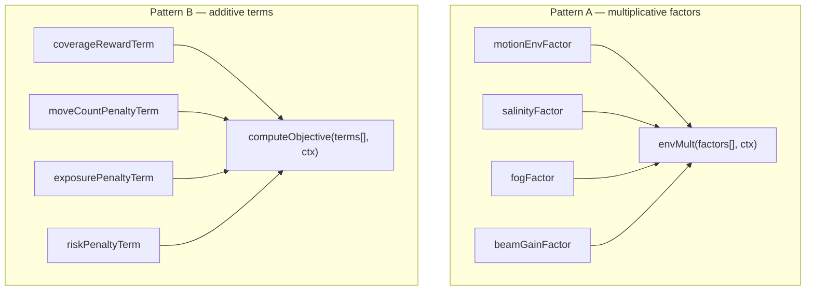

| Pattern | Used for | How to extend |
|---------|----------|---------------|
| **Product** (`EnvFactor[]`) | Sensor quality degradation | Append to `DEFAULT_ENV_FACTORS` — no `effectiveQuality` changes |
| **Sum** (`ObjectiveTerm[]`) | Plan ranking penalties/rewards | Append to `DEFAULT_OBJECTIVE_TERMS` — no `generateCandidates` changes |
| **Interface swap** | Whole-algorithm replacement | Implement `Planner`, `RoutePlanner`, `Summarizer`, `Estimator`; inject via `EngineInput` or optional arg |
| **Dispatch** | Leaf-kind branching | Add case in `computeTaskLeaf` only — rollup (`coverageMission`) stays unchanged |

### What must NOT change when swapping a body

| Caller | Must keep calling |
|--------|-------------------|
| `tick.ts` | `recomputeMissionStatesWithVisits(input, tick)` — same signature |
| `planner.ts` | `recomputeMissionStates` on sandboxed `EngineInput` clone |
| `ingest.ts` | `reconcile()` for every merge — never inline merge logic |
| `monitor.ts` | Reads `MissionState` rows — never recomputes coverage |
| `summarize.ts` | Receives pre-computed numbers — never computes salience (P8) |
| CI guards | `lint-engine.mjs`, `lint-rollup-purity.mjs`, `lint-planner-purity.mjs` |

### Recommended swap order (from EXPANSION_REGISTER)

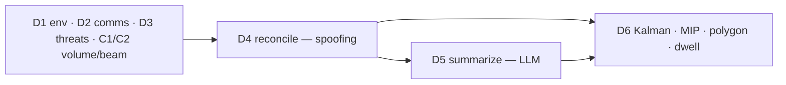

**Next recommended work:** **D4** — implement spoofing in `reconcile.ts` (conflicting reports lower confidence instead of silently overwriting belief).

---

## 9. UI ontology

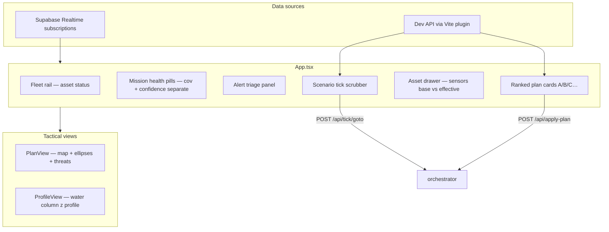

The UI **displays** engine concepts (tier, salience, effective quality) but does not own business logic. Operator actions flow back through the orchestrator API.

---

## 10. Environment & threats (supporting ontology)

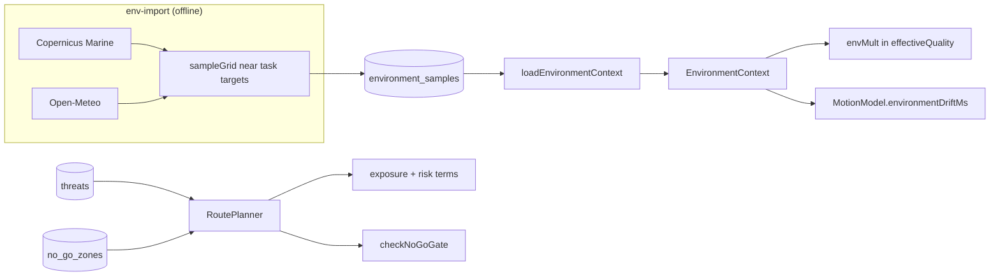

---

## 11. Design principles crosswalk

| ID | Principle | Where enforced |
|----|-----------|----------------|
| P1 | Contracts freeze, bodies expand | Seam files + EXPANSION_REGISTER |
| P2 | State engine is pure | `stateEngine.ts`; `lint-engine.mjs` |
| P3 | `MissionState` is the one derived object | `recomputeMissionStates`; no duplicate math in monitor/planner |
| P4 | Capability is a sensor vector | `asset_sensors` rows; `checkCapacityGate` |
| P5 | Gate then grade | `INFEASIBLE` before scoring; `task_constraints` vs `task_demands` |
| P6 | Coverage ≠ confidence | Separate columns; property tests |
| P7 | min within task, weighted avg across mission | `coverageTask` / `coverageMission` |
| P8 | LLM narrates only | `summarize()`; `alert_log.summary_text` |
| P9 | Do-nothing plan always evaluated | `generateCandidates` baseline |
| P10 | Objective ranks, doesn't reveal truth | Config λ weights; operator commits |

---

## 12. File → responsibility quick map

| Path | Responsibility |
|------|----------------|
| `packages/engine/src/coverage.ts` | `effectiveQuality`, satisfaction, tier |
| `packages/engine/src/stateEngine.ts` | `EngineInput`, `recomputeMissionStates`, gates |
| `packages/engine/src/planner.ts` | Candidate generation, sandbox eval, ranking |
| `packages/engine/src/applyPlan.ts` | Commit validation |
| `packages/engine/src/monitor.ts` | `scanBelief`, salience gate helpers |
| `packages/engine/src/volume/*` | AREA patrol discretization + sweep |
| `packages/engine/src/routePlanner.ts` | Threat exposure/risk, no-go |
| `packages/db/src/missions.ts` | `buildEngineInputFromDb` |
| `apps/orchestrator/src/tick.ts` | Production tick wiring |
| `apps/orchestrator/src/scenario-run.ts` | Demo scenario replay |
| `apps/ui/src/App.tsx` | Operator console shell |
| `supabase/migrations/*.sql` | Schema contract (incremental) |

---

## 13. Glossary

| Term | Definition |
|------|------------|
| **Belief** | Everything the system knows about the fleet; never includes sim ground truth in engine |
| **Operating point** | Opaque speed/mode handle resolved to capacity + bearing via `OperatingPointResolver` |
| **Demand** | Graded per-sensor quality need (`task_demands`) |
| **Constraint** | Hard pass/fail gate (`task_constraints`) |
| **Disruption** | Monitor finding (comms loss, battery, stale belief, health) |
| **Salience** | `impact × urgency × confidence`; drives alert visibility |
| **Cascade** | Secondary mission coverage drop caused by a reassignment |
| **Volume visit** | Per-cell patrol memory for AREA tasks |
| **Planning override** | Hypothetical position for sandbox patrol eval only (never live tick) |

---

*Generated for the Mission Orchestrator monorepo (June 2026). Update this file when adding migrations, seams, or new task leaf kinds.*
