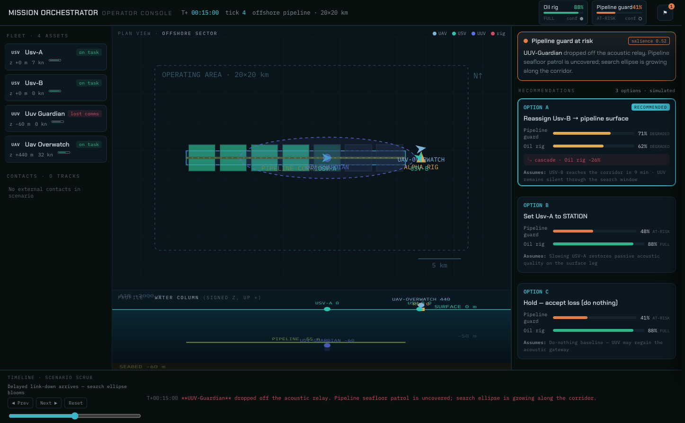
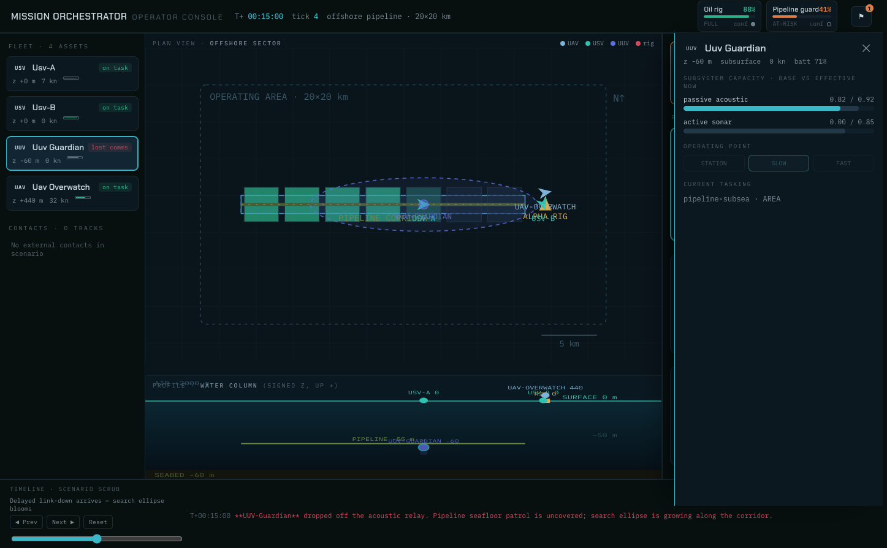

# Mission Orchestrator

Single-operator decision support for a fleet of unmanned naval vehicles. When a vehicle fails or
degrades, the system recomputes how every mission is affected and recommends the least-bad
reassignment — **the operator decides, the system commits**.

## Operator console

The operator console shows the fleet, a top-down plan view, a water-column profile,
mission health (coverage and confidence kept separate), alerts, and ranked plans.

Run `pnpm --filter @mission-orchestrator/ui dev` → http://localhost:5173  
Append `?demo=1` to see the captured tick-4 state below without a live database.

### Tick 4 — UUV comms loss

UUV-Guardian drops off the acoustic relay. A search ellipse grows around last known position,
pipeline coverage goes AT-RISK, and the planner ranks options — including do-nothing.



| Region | What it shows |
|--------|----------------|
| **Header** | Mission health pills — coverage bar + separate confidence dot |
| **Fleet rail** | Four assets (USV / UUV / UAV) with z, speed, battery, comms |
| **Plan view** | 20×20 km chart: pipeline corridor, visited cells, Alpha rig, search ellipse |
| **Water column** | Side elevation — air / surface / seafloor (−60 m) |
| **Decision column** | Salience-gated alert + ranked plans. **Accept & commit** runs `applyPlan` |
| **Timeline** | Scenario scrubber, ticks 0–8 |

### Asset drawer

Click an asset for sensor base vs effective quality *now*, operating point, and current tasking.



## Quick start

```bash
pnpm install
pnpm --filter @mission-orchestrator/ui dev
```

Open http://localhost:5173 (or http://localhost:5173/?demo=1). Full scenario walkthrough:
[SCENARIO_OFFSHORE.md](SCENARIO_OFFSHORE.md).

## What’s in the repo

| Path | Role |
|------|------|
| `packages/engine` | Pure coverage / planner / monitor (no DB) |
| `packages/db` | Supabase client + typed queries |
| `packages/env-import` | Ocean / weather field import |
| `apps/orchestrator` | Tick loop + CLI |
| `apps/ui` | Operator console |

## Docs

- [SCENARIO_OFFSHORE.md](SCENARIO_OFFSHORE.md) — demo fleet, timeline, how to run the loop
- [HANDOVER.md](HANDOVER.md) — current status and next work (Phase D4+)
- [BUILD.md](BUILD.md) — formulas, contracts, and the original build ladder
- [EXPANSION_REGISTER.md](EXPANSION_REGISTER.md) — seams and deferred work
